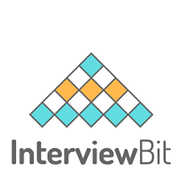

# interviewbitwise-topic

## What you can find in this repository  ---- daily updates

You will find notes about compeititve programming, time and space analysis, algorithm and data structures and advices that I have matured during my experience and studies. 

|    Name  | Number of solutions |
|----------|:----------------:|
|[Array](array/README.md)|1|
|[Time Complexity](time-complexity/README.md)|10|
|[Math](math/README.md)|3|
|[Bit manipulation](bit-manipulation/README.md)|2|
|[Binary Search](binary-search/README.md)|2|
|[Linked List](linked-list/README.md)|2|
|[Databases](databases/README.md)|1|
|[Stack and queue](stack-and-queue/README.md)|1|
|[String](string/README.md)|3|

## How to contribute?
1. Fork the repository
2. Do the desired changes (add/delete/modify)
3. Make a pull request

## When to contribute?
1. If there is no solution to a problem in the main branch.
2. If your solution is asymptotically faster than the one in the main branch.
3. If your algorithm is of the same time complexity but with reduced code size. In this case, comment out the original solution and make a pull request with your solution.
4. If you have another method of solving the problem which is asymptotically slower than the original method then, comment your solution in the main file and make a pull request.
5. If you woukd like to make any positive change to the lectures content

## How to contribute?
1. Fork the repository
2. Do the desired changes (add/delete/modify)
3. Make a pull request

## When to contribute?
1. If there is no solution to a problem in the main branch.
2. If your solution is asymptotically faster than the one in the main branch.
3. If your algorithm is of the same time complexity but with reduced code size. In this case, comment out the original solution and make a pull request with your solution.
4. If you have another method of solving the problem which is asymptotically slower than the original method then, comment your solution in the main file and make a pull request.

## Mind that
Constructive criticisms or code reviews of any kind are very much welcome.

If you have any questions about the solutions you can find here, feel free to contact me at: [davidepollicino2015@gmail.com](mailto:davidepollicino2015@gmail.com?subject=[GitHub]%20BitwiseRepo)

## Solutions

* [Time Complexity](time-complexity/time-complexity.md)

## Lets' connects

* [davidepollicino2015@gmail.com](mailto:davidepollicino2015@gmail.com?subject=[GitHub]%20CompetitiveProgrammigGuide)
* [Linkedin](https://www.linkedin.com/in/davidepollicino7/)
* [www.davidepollicino.com](http://davidepollicino.com/)

